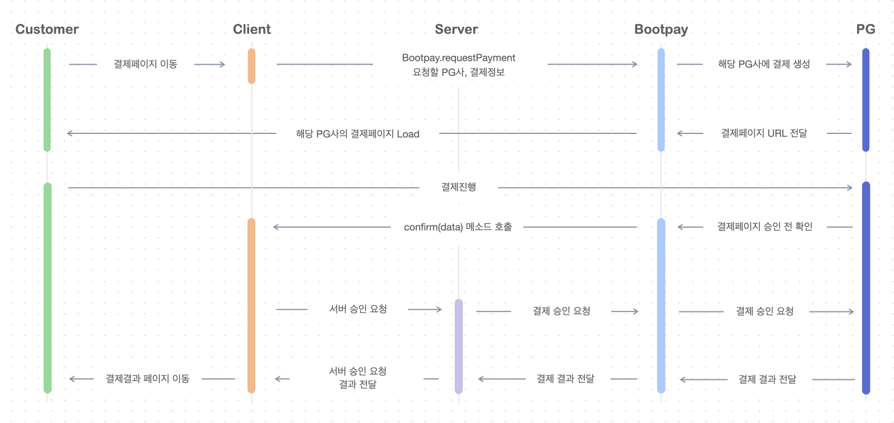

# 서버에서 결제승인

## 기존 클라이언트 사이드에서 결제승인 요청

부트페이 클라이언트에서는 `confirm 함수`에서 클라이언트에서 다음과 같은 코드로 결제 승인 요청을 하게 됩니다.

```java
BootPay.transactionConfirm(data);
```

위 방법은 클라이언트 사이드에서 승인요청하는 것이기 때문에 서버에서 엄밀한 트랜젝션을 통해 결제 승인을 하는 방식은 아닙니다.&#x20;


**클라이언트에서 지원하는 transaction의 문제점이 무엇인가요?**

결제 승인을 위한 조건을 가맹점 서버로 물어보는 과정이 필요한데 가맹점 서버로 통신하는 순간 다른 사용자의 요청에 의해 재고가 떨어지거나 혹은 판매 상태가 변경된 경우 결제 완료 처리에서 문제가 발생됩니다.\
약한 결제 Transaction 인 경우에 클라이언트 사이드에서 처리해도 되지만 매우 엄밀한 결제 **단일 Transaction이** 필요한 경우에는 **REST API로 서버에서 결제승인**을 요청해야합니다.



**단일 Transaction 결제승인 이란?**

데이터베이스 Transaction 안에서 결제 승인 / 결제 승인 에러 등을 처리를 하는 방법입니다.\
단일한 세션 ( 먼저 진입한 요청 )으로만 처리가 되어야하고 서버 내에서 처리가 되는 Transaction이 필요한 경우 서버에서 결제승인 요청하는 방법을 추천합니다.


## 서버에서 결제승인

서버에서 결제승인을 진행하는 방식이 단일 Transaction 결제승인 방식이라 할 수 있겠습니다. 전체적인 흐름은 아래와 같습니다.



## 서버사이드에서 결제승인 요청하기


**STEP1. Confirm 함수 호출 시 개발사 서버로 receipt\_id 전달 후 Transaction 시작**

SDK에서 confirm 함수 ( 결제 승인 이전 호출 )가 호출되면 confirm 함수에서 받은 receipt\_id를 가맹점 서버로 보냅니다. 이때 서버에서는 [결제검증](https://docs.bootpay.co.kr/deep/submit)을 해서 결제한 금액이 일치하는지와 status 값이 2 ( 결제 승인전 상태 값 )인지 확인 후 가맹점 서버 내에서 필요한 트랜젝션 ( 재고 차감이나 혹은 결제에 관련된 상태값 )을 시작합니다.

**STEP2. 서버 승인 요청하기**&#x20;



```perl
curl -H "Content-Type: application/json" \
-H "Authorization: d6941c650061e3eaddd3f4718ab63e0983c1f6a0a0a01370c1b1ffa90ddd0b51" \
https://api.bootpay.co.kr/receipt/5afd6be8e13f33616f2876ac

```



## 설치하기&#x20;

[Composer](http://getcomposer.org)을 통해 설치 ([Github](https://github.com/bootpay/backend-php) 주소)

```javascript
composer require bootpay/backend-php
```

## 사용 예제&#x20;

```php
<?php
/*
 * 결제 검증 관련 예제입니다.
 */
require_once '../vendor/autoload.php';
use Bootpay\BackendPhp\BootpayApi; 

$price = 3000; // 원래 서버에서 결제하려고 했던 금액
$receiptId = '5c6dfb1fe13f3371b38f9008';

$bootpay = BootpayApi::setConfig(
    '59bfc738e13f337dbd6ca48a',
    'pDc0NwlkEX3aSaHTp/PPL/i8vn5E/CqRChgyEp/gHD0='
);

$response = $bootpay->requestAccessToken();

if ($response->status === 200) {
    // 결제 승인 전 금액을 비교하기 위해서 verification함수를 호출합니다.
    $result = $bootpay->verify($receiptId);
    // 서버에서 200을 받고, 원래 결제하려고 했던 금액과 일치하면 서버에 submit을 보냅니다.
    if ($result->status == 200 && $result->data->price == $price) {
        $receiptData = $bootpay->submit($receiptId);
        // 결제 완료되면 status 200을 리턴하고 실패하면 에러를 호출하며, 결제가 승인이 되지 않은 사유에 대해서 $receiptData->message로 받아보실 수 있습니다.
        // 해당 데이터는 결제완료된 시점의 JS SDK의 done함수에서 호출되어 보내는 데이터와 동일합니다.
        var_dump($receiptData);
    }
}
```



## 설치하기

[Gemfile](https://rubygems.org) 을 통해 설치 ([Github](https://github.com/bootpay/backend-php) 주소)

```javascript
gem 'backend-ruby'
```

위 라인 추가 후 `bundle install` 실행&#x20;

## 사용 예제

```php
# 결제 검증하기 
receipt_id = '612df0250d681b001de61de6'

api = Bootpay::Api.new(
  application_id: '5b8f6a4d396fa665fdc2b5ea',
  private_key:    'rm6EYECr6aroQVG2ntW0A6LpWnkTgP4uQ3H18sDDUYw=',
)

receipt_id = '612e09260d681b0021e61ab9'
if api.request_access_token.success?
  response = api.server_submit(receipt_id)
  puts response.data.to_json
end
```



## NPM 통해 설치하기&#x20;

```c
npm install bootpay-backend-nodejs
```

## 사용예제&#x20;

```javascript
async function submit() {
    const Bootpay = require('bootpay-backend-nodejs').Bootpay
    Bootpay.setConfig(
        '5b8f6a4d396fa665fdc2b5ea',
        'rm6EYECr6aroQVG2ntW0A6LpWnkTgP4uQ3H18sDDUYw='
    )
    let token = await Bootpay.getAccessToken()
    if (token.status === 200) {
        let response
        try {            
            response = await Bootpay.verify('612df0250d681b001de61de6')
        } catch (e) {
            return console.log(e)
        }
        console.log(response)
    }
}
```



## 설치하기

[Pypl](https://pypi.org) 을 통해 설치 ([Github](https://github.com/bootpay/backend-python) 코드 보기)

```javascript
pip install bootpay 
```

## 사용 예제

```python
from bootpay import Bootpay

bootpay = Bootpay('5b8f6a4d396fa665fdc2b5ea', 'rm6EYECr6aroQVG2ntW0A6LpWnkTgP4uQ3H18sDDUYw=')
bootpay.get_access_token() # 토큰 얻어오기

result = bootpay.submit('612df0250d681b001de61de6')
print(result)
```



## 설치하기

[Gradle](https://gradle.org) 을 통해 설치 ([Github](https://github.com/bootpay/backend-java) 코드 보기)


```javascript
repositories {
    maven { url 'https://jitpack.io' }
    mavenCentral()
}

dependencies {
    implementation 'com.github.bootpay:backend-java:+'
}
```


## 사용 예제

```java
import kr.co.bootpay.Bootpay;
import kr.co.bootpay.model.response.ResDefault;

bootpay = new Bootpay("5b8f6a4d396fa665fdc2b5ea", "rm6EYECr6aroQVG2ntW0A6LpWnkTgP4uQ3H18sDDUYw=");
        
public static void submit() {
    String receiptId = "6100e8e7019943003850f9b0";
    try {
        ResDefault<HashMap<String, Object>> res = bootpay.submit(receiptId);
        System.out.println(res.toJson());
    } catch (Exception e) {
        e.printStackTrace();
    }
}
```



## 설치하기 ([Github](https://github.com/bootpay/backend-go) 주소)

```javascript
go get github.com/bootpay/backend-go
```

## 사용 예제

```go
package main

import (
    "fmt"
    "github.com/bootpay/backend-go"
)

func main() {
    api := bootpay.Api{}.New("5b8f6a4d396fa665fdc2b5ea", "rm6EYECr6aroQVG2ntW0A6LpWnkTgP4uQ3H18sDDUYw=", nil, "")
    api.GetToken()
    ServerSubmit(api) 
}

func ServerSubmit(api *bootpay.Api) {
    receiptId := "610cc01b238684002adb904e"
    fmt.Println("--------------- ServerSubmit() Start ---------------")
    res, err := api.ServerSubmit(receiptId)
    
    fmt.Println(res)
    if err != nil {
    	fmt.Println("get token error: " + err.Error())
    }
    fmt.Println("--------------- ServerSubmit() End ---------------")
}
```



### 1. Visual Studio에서 추가하기

1\. 솔루션 탐색기(Solution Explorer) 열기 \
2\. 만드신 솔루션 프로젝트 우클릭 \
3\. Manage Nuget Packages 클릭 \
4-1.  '[Bootpay.framework](https://www.nuget.org/packages/Bootpay.framework)' (.net standard 2.0 이상)\
4-2.  또는 '[Bootpay.net](https://www.nuget.org/packages/Bootpay.net)' (.net core 3.1 이상)

## 2. 사용 예제&#x20;

```javascript
BootpayApi api = new BootpayApi("5b8f6a4d396fa665fdc2b5ea", "rm6EYECr6aroQVG2ntW0A6LpWnkTgP4uQ3H18sDDUYw=");
await api.GetAccessToken();
var res = await api.Submit("612df0250d681b001de61de6");

string json = JsonConvert.SerializeObject(res,
        Newtonsoft.Json.Formatting.None,
        new JsonSerializerSettings
        {
            NullValueHandling = NullValueHandling.Ignore
        });


return Ok(json);
```



## 기술문의&#x20;

이 섹션에 대해 궁금하신 부분은 [채팅](https://bootpay.channel.io)으로 문의주시면 감사하겠습니다.&#x20;
