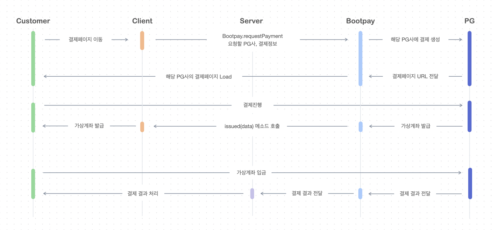

# 가상계좌

#### 가상계좌 결제 개요

가상계좌 결제는 다른 결제와 달리 가상계좌 번호가 생성된 후 입금이 되어야 결제가 끝나는 로직으로 진행이 됩니다.  그렇기 때문에 입금이 완료되었을 때 부트페이 서버로 부터 [서버로 통지 받으신 후](../webhook/server.md) 결제 완료 처리를 따로 하셔야 합니다.

## **가상계좌 결제 Flow에 대한 간략한 설명**

1. 부트페이 SDK를 통해 가상계좌 결제를 요청합니다. ( 판매 아이템 이름 / 금액 / 기타 정보 전송 )
2. 부트페이 서버가 해당 정보를 받아 PG사로 결제 정보 데이터를 전송하여 결제창을 요청합니다.
3. PG사는 사용자 웹브라우저로 가상계좌 발급을 위한 페이지를 로드합니다.
4. 사용자는 가상계좌 발급을 위한 정보를 입력하고 정보를 PG사로 바로 전송합니다.
5. PG사는 전송 받은 데이터를 기반으로 가상계좌를 발급하고 부트페이 서버로 발급된 가상계좌 정보를 보냅니다.
6. 부트페이 서버가 사용자의 브라우저로 발급받은 가상계좌 정보를 보냅니다. (`onReady` 함수 호출)
7. 사용자 브라우저로 전송된 가상계좌 입금 관련 데이터를 구현하려는 백엔드 서버로 전송 후 저장합니다.
8. 사용자가 가상계좌로 입금하게 되면 PG사의 서버로 입금 관련 정보가 전달됩니다.
9. PG로 전달된 입금 데이터를 부트페이 서버로 전달합니다.
10. 부트페이 서버는 해당 가상계좌과 연결된 결제 영수증을 조회하여 **결제완료**처리를 하고 부트페이 관리자에서 설정하였던 **Feedback URL**로 [입금된 데이터를 전송](../webhook/server.md)합니다. 데이터를 전송 받은 후 결제 완료 처리를 하시면 됩니다.


### 가상계좌 테스트 시 주의사항

가상계좌의 경우 계좌간 계좌이체 방식이기 때문에 이체간 비용이 발생합니다. PG사에서 정책적으로 가상계좌는 테스트 시 **결제취소 기능을 제공하지 않습니다**. 가상계좌를 테스트 하기 위해서는 PG사 가맹 후 발급받은 코드로 진행하시길 추천합니다.


## **입금 후 Feedback URL로 오는 데이터**

입금 후 부트페이 관리자에서 설정한 FeedbackURL을 통해 오는 데이터는 [REST API > 결제 피드백 받기](https://docs.bootpay.co.kr/rest/feedback) 페이지에서 확인 할 수 있습니다.

## 실결제 모드시 주의사항

PG 사에 가맹이 되시면, PG사로부터 이메일 등을 통해 PG 가맹 아이디 및 연동 키, 관리자 로그인 방법 등을 안내받게 되십니다. 부트페이 관리자의 결제수단 활성화 메뉴에서 실결제 모드를 활성 화 후 안내받으신 키 값을 결제수단별로 입력해주시면 되겠습니다. 실결제 모드로 활성화 후에 결제테스트를 해보시면서 실제로 PG사의 전산에서도 결제내역으로 조회가 되는지 확인해주시면 되겠습니다.

또한 PG사 전산에 부트페이 IP를 등록하셔야 할 수 있습니다.

1. [취소 API 설정](../server/cancel.md#pg-ip) - 부트페이 IP를 추가해주셔야 합니다. (`KCP` 이용시)
2. [가상계좌 입금 Webhook 설정](../webhook/server.md#pg) - 고객이 발급받은 가상계좌에 입금할 경우 PG사가 부트페이 서버에 통지해주어야 하기 때문에, 부트페이 URL을 설정해주셔야 합니다. (`KCP`, `이니시스`, `나이스페이` 이용시)

## 기술문의&#x20;

이 섹션에 대해 궁금하신 부분은 [채팅](https://bootpay.channel.io)으로 문의주시면 감사하겠습니다.&#x20;
