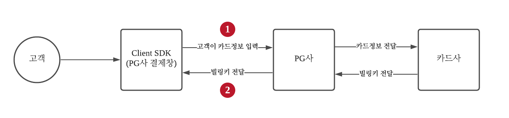

# 1-1. 빌링키 발급받기 (인증)

**카드 정기결제 인증 방식은 2가지 방식이 있습니다.** PG사 결제창에서 고객의 본인인증 후 카드정보를 입력받아 빌링키를 발급받는 **인증 방식**과, 개발사에서 고객의 카드정보를 받아 PG사로 전달하여 빌링키를 발급받는 **비인증 방식**이 있습니다.

## **빌링키 발급받기** 소개\*\*(인증 방식)\*\*

***




## 부트페이 클라이언트 SDK 설치하기

인증 방식은 PG사 결제창을 통해 빌링키를 발급받기 때문에 [일반결제](../pg/) 연동방법과 같습니다.

먼저 부트페이를 설치하기 위해서는 [일반결제](../pg/)의 개발중인 개발환경의 bootpay 설치하기를 참조해주세요.

## 빌링키 발급받기 예제

일반결제 연동방법과 비교하여`price, method` 값만 바꿔주시면 됩니다.\
(지원 PG사: `kcp`, `danal`, `payletter`, `inicis`, `welcome`, `nicepay`, `payapp`)



```javascript
BootPay.request({
	...
	pg: 'kcp',
	method: 'card_rebill', //정기결제 
	price: 0, //빌링키 발급시점에는 가격을 0으로 설정

	...
})
```



```java
Payload payload = new Payload();
payload.setPg("kcp")
       .setMethod("card_rebill"); //정기결제 
       .setPrice(0) //빌링키 발급시점에는 가격을 0으로 설정 

Bootpay.setPayload(payload)
       .requestPayment();
```



```swift
let payload = BootpayPayload()
payload.pg = "kcp"
payload.method = "card_rebill" //정기결제 
payload.price = 0 //빌링키 발급시점에는 가격을 0으로 설정 

Bootpay.request(self, sendable: self, payload: payload)
```



```dart
Payload payload = Payload();
payload.pg = 'kcp';
payload.method = 'card_rebill'; //정기결제 
payload.price = 0; //빌링키 발급시점에는 가격을 0으로 설정 

Bootpay().request(
    ..
    payload: payload
    ..
);
```



```jsx
const bootpay = useRef<BootpayWebView>(null);

const payload = {
    ...
    pg: 'kcp', 
    method: 'card_rebill', //정기결제 
    price: 0, //빌링키 발급시점에는 가격을 0으로 설정 
    ...
}

if(bootpay != null && bootpay.current != null) bootpay.current.request(payload, items, user, extra);
```



```javascript
//빌링키 발급결과
{
  "status": 200,
  "code": 0,
  "message": "",
  "data": {
    "billing_key": "5ec37382dfea2e001a7f1e10",
    "pg_name": "나이스정보통신",
    "pg": "nicepay",
    "method_name": "카드정기결제",
    "method": "card_rebill_rest",
    "data": {
      "card_code": "07",
      "card_name": "[현대]",
      "card_no": "90002000****1000",
      "card_cl": "0" // 1 - 체크, 0 - 신용 ( 나이스페이만 리턴 )
    },
    "e_at": "2024-03-31 23:59:59", // 카드 정기결제 빌링키 만료 일자
    "c_at": "2021-07-19 14:49:54" // 카드 정기결제 요청 시간
  }
}
```

## **1-2. 빌링키 발급받기 (비인증 방식)**

비인증 방식은 PG사의 결제창이 아닌 개발사의 UI에서 받기때문에 **결제창을 커스텀하게 꾸미실 수 있는 효과**가 있습니다. 고객으로 받은 카드정보를 서버사이드에서 **REST API 방식으로 전송**해야 하기 때문에 클라이언트가 아닌 **서버사이드에서 빌링키 발급요청을 수행**해야 합니다. (지원 PG사:`nicepay, payapp, welcome`)







결제하려는 pg code 값



고객의 카드 번호



고객의 카드 비밀번호 앞 2자리



고객의 카드 만료 년



고객의 카드 만료 월



고객의 주민등록번호 또는 법인 번호(- 없이 입력)

\\

_(일부 PG는 법인 카드 결제가 안될 수 있습니다)_



결제할 상품명



개발사에서 관리하는 고유 거래 번호



_`payapp`은 구매자 전화번호, 이름이 필수입니다_

\\

(string) phone - 구매자 전화번호

\\

(string) username - 구매자 이름

\\

(string) address - 구매자 주소



```r
{
  "status": 200,
  "code": 0,
  "message": "",
  "data": {
    "billing_key": "5ec37382dfea2e001a7f1e10",
    "pg_name": "나이스정보통신",
    "pg": "nicepay",
    "method_name": "카드정기결제",
    "method": "card_rebill_rest",
    "data": {
      "card_code": "07",
      "card_name": "[현대]",
      "card_no": "90002000****1000",
      "card_cl": "0" // 1 - 체크, 0 - 신용 ( 나이스페이만 리턴 )
    },
    "e_at": "2024-03-31 23:59:59", // 카드 정기결제 빌링키 만료 일자
    "c_at": "2020-05-19 14:49:54" // 카드 정기결제 요청 시간
  }
}
```



## 1-2-2. 언어별 예제



```perl
curl -H "Content-Type: application/json" \
-H "Authorization: d6941c650061e3eaddd3f4718ab63e0983c1f6a0a0a01370c1b1ffa90ddd0b51" \
-d '{"pg": "[[ 선택할 PG ]]", "card_no": "9100100020003000", "card_pw": "00", "expire_year": "99", "expire_month": "12", "identify_number":"901010", "item_name": "30일 정기결제", "order_id": "[ 주문번호 ]"}' \
-X POST https://api.bootpay.co.kr/request/card_rebill.json
```



### 설치하기

[Composer](http://getcomposer.org)을 통해 설치 ([Github](https://github.com/bootpay/backend-php) 주소)

```javascript
composer require bootpay/backend-php
```

### 사용 예제

```php

<?php
/*
 * 결제 검증 관련 예제입니다.
 */
use Bootpay\BackendPhp\BootpayApi; 

$receiptId = '612c31000199430036b5165d'; //부트페이 영수증 번호 

$bootpay = BootpayApi::setConfig(
    '5b8f6a4d396fa665fdc2b5ea', //발급받은 rest application id
    'rm6EYECr6aroQVG2ntW0A6LpWnkTgP4uQ3H18sDDUYw=' //발급받은 prviate_key
);

$response = $bootpay->requestAccessToken();

if ($response->status === 200) { 
    $result = $bootpay->getSubscribeBillingKey(
        'nicepay',
        time(),
        '30일 정기권 결제', 
        '카드 번호',
        '카드 비밀번호 앞에 2자리',
        '카드 만료 연도 2자리',
        '카드 만료 월 2자리',
        '주민등록번호 또는 사업자번호'
    ); 

    var_dump($result); 
}
```



### 설치하기

[Gemfile](https://rubygems.org) 을 통해 설치 ([Github](https://github.com/bootpay/backend-php) 주소)

```javascript
gem 'backend-ruby'
```

위 라인 추가 후 `bundle install` 실행

### 사용 예제

```php
# 결제 검증하기 
receipt_id = '612df0250d681b001de61de6'

api = Bootpay::Api.new(
  application_id: '5b8f6a4d396fa665fdc2b5ea',
  private_key:    'rm6EYECr6aroQVG2ntW0A6LpWnkTgP4uQ3H18sDDUYw=',
)

api.request_access_token

if api.request_access_token.success? 
  response = api.get_billing_key(
    order_id:         '1234',
    pg:               'nicepay',
    item_name:        '테스트 결제',
    card_no:          '카드 번호', # 값 할당 필요
    card_pw:          '카드 비밀번호 앞에 2자리', # 값 할당 필요
    expire_year:      '카드 만료 연도 2자리', # 값 할당 필요
    expire_month:     '카드 만료 월 2자리', # 값 할당 필요
    identify_number:  '주민등록번호 또는 사업자번호' # 값 할당 필요
  )
  puts response.data.to_json
end
```



### NPM 통해 설치하기

```c
npm install bootpay-backend-nodejs
```

### 사용예제

```javascript
async function getBillingKey() {
    const Bootpay = require('bootpay-backend-nodejs').Bootpay
    Bootpay.setConfig(
        '5b8f6a4d396fa665fdc2b5ea',
        'rm6EYECr6aroQVG2ntW0A6LpWnkTgP4uQ3H18sDDUYw='
    )
    let token = await Bootpay.getAccessToken()
    if (token.status === 200) {
        let response
        try { 
            response = await Bootpay.requestSubscribeBillingKey({
                orderId: (new Date()).getTime(),
                pg: 'nicepay',
                itemName: '정기결제 30일권',
                cardNo: '카드 번호',
                cardPw: '카드 비밀번호 앞에 2자리',
                expireYear: '카드 만료 연도 2자리',
                expireMonth: '카드 만료 월 2자리',
                identifyNumber: '주민등록번호 또는 사업자번호',
                extra: {
                    subscribeTestPayment: 1 // 100원 결제 후 결제가 되면 billing key를 발행, 결제가 실패하면 에러
                }
            })
        } catch (e) {
            console.log(e)
            return
        }
        console.log(response)
    }
}
```



### 설치하기

[Pypl](https://pypi.org) 을 통해 설치 ([Github](https://github.com/bootpay/backend-python) 코드 보기)

```javascript
pip install bootpay 
```

### 사용 예제

```python
from bootpay import Bootpay

bootpay = Bootpay('5b8f6a4d396fa665fdc2b5ea', 'rm6EYECr6aroQVG2ntW0A6LpWnkTgP4uQ3H18sDDUYw=')
result = bootpay.get_access_token() # 토큰 얻어오기

result = bootpay.get_subscribe_billing_key(
        'nicepay',
        '1234-1234-1234',
        '30일 결제권',
        '카드 번호',
        '카드 비밀번호 앞에 2자리',
        '카드 만료 연도 2자리',
        '카드 만료 월 2자리',
        '주민등록번호 또는 사업자번호',
        None,
        {
            'subscribe_test_payment': 1
        }
    )
print(result)
```



### 설치하기

[Gradle](https://gradle.org) 을 통해 설치 ([Github](https://github.com/bootpay/backend-java) 코드 보기)


```javascript
repositories {
    maven { url 'https://jitpack.io' }
    mavenCentral()
}

dependencies {
    implementation 'com.github.bootpay:backend-java:+'
}
```


### 사용 예제

```java
import kr.co.bootpay.Bootpay;
import kr.co.bootpay.model.response.ResDefault;


bootpay = new Bootpay("5b8f6a4d396fa665fdc2b5ea", "rm6EYECr6aroQVG2ntW0A6LpWnkTgP4uQ3H18sDDUYw=");
        
public void getBillingKey() {
    Subscribe subscribe = new Subscribe();
    subscribe.itemName = "정기결제 테스트 아이템";
    subscribe.orderId = "" + (System.currentTimeMillis() / 1000);
    subscribe.pg = "nicepay";
    subscribe.cardNo = "5570**********1074"; //실제 테스트시에는 *** 마스크처리가 아닌 숫자여야 함
    subscribe.cardPw = "**"; //실제 테스트시에는 *** 마스크처리가 아닌 숫자여야 함
    subscribe.expireYear = "**"; //실제 테스트시에는 *** 마스크처리가 아닌 숫자여야 함
    subscribe.expireMonth = "**"; //실제 테스트시에는 *** 마스크처리가 아닌 숫자여야 함
    subscribe.identifyNumber = ""; //주민등록번호 또는 사업자 등록번호 (- 없이 입력)

    try {
        ResDefault<BillingKeyData> res = bootpay.getBillingKey(subscribe);
        System.out.println(res.toJson());
    } catch (Exception e) {
        e.printStackTrace();
    }
}
```



### 설치하기 ([Github](https://github.com/bootpay/backend-go) 주소)

```javascript
go get github.com/bootpay/backend-go
```

### 사용 예제

```go
package main

import (
    "fmt"
    "github.com/bootpay/backend-go"
    "time"
)

func main() {
    api := bootpay.Api{}.New("5b8f6a4d396fa665fdc2b5ea", "rm6EYECr6aroQVG2ntW0A6LpWnkTgP4uQ3H18sDDUYw=", nil, "")
    api.GetToken()
    GetToken(api)    
}

// 1. 토큰 발급
func GetToken(api *bootpay.Api) {
    fmt.Println("--------------- GetToken() Start ---------------")
    token, err := api.GetToken()
    fmt.Println("token : " + token.Data.Token)
    if err != nil {
      fmt.Println("get token error: " + err.Error())
    }
    fmt.Println("--------------- GetToken() Start ---------------")
}
```



#### 1. Visual Studio에서 추가하기

1\. 솔루션 탐색기(Solution Explorer) 열기\
2\. 만드신 솔루션 프로젝트 우클릭\
3\. Manage Nuget Packages 클릭\
4-1. '[Bootpay.framework](https://www.nuget.org/packages/Bootpay.framework)' (.net standard 2.0 이상)\
4-2. 또는 '[Bootpay.net](https://www.nuget.org/packages/Bootpay.net)' (.net core 3.1 이상)

### 2. 사용 예제

```javascript
BootpayApi api = new BootpayApi("5b8f6a4d396fa665fdc2b5ea", "rm6EYECr6aroQVG2ntW0A6LpWnkTgP4uQ3H18sDDUYw=");
await api.GetAccessToken();
var res = await api.Verify("612df0250d681b001de61de6");

string json = JsonConvert.SerializeObject(res,
        Newtonsoft.Json.Formatting.None,
        new JsonSerializerSettings
        {
            NullValueHandling = NullValueHandling.Ignore
        });


return Ok(json);
```




**정기결제를 처음 연동했는데, 빌링키가 발급되지 않아요.**

sandbox mode를 통해 정기결제를 구현할 경우 빌링키가 발급되지 않을 수 있습니다.\
PG사 심사완료 후 발급받으신 CP Code를 부트페이 전산에 입력 후, sandbox mode가 아닌 실 결제모드로 진행하시기 바랍니다.



**빌링키 유효기간 만료시**

발급받은 빌링키는 유효날짜 전까지는 사용이 가능합니다. 기간이 만료되면 기존 빌링키는 더 이상 사용할 수 없어 결제가 불가능합니다. 다시 결제를 하기위해서는 빌링키를 다시 발급받아야 합니다. 유효기간과 상관없이 빌링키를 삭제하고 싶을 경우 [빌링키 삭제하기](undefined-4.md)를 참조하세요.


## 기술문의

이 섹션에 대해 궁금하신 부분은 [채팅](https://bootpay.channel.io)으로 문의주시면 감사하겠습니다.
