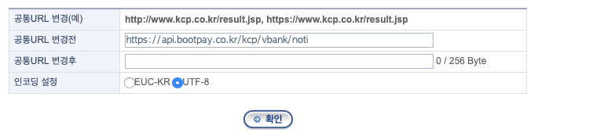
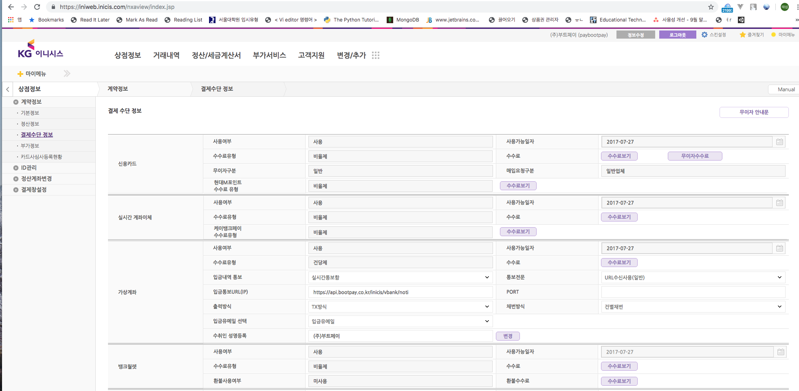
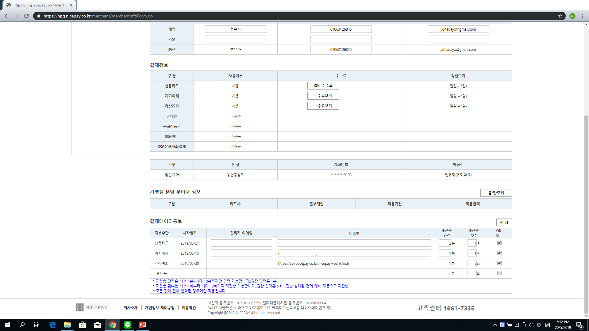

# 서버로 통지 받기 (Webhook)

결제상태가 변경(승인완료/취소)되면 부트페이 서버로부터 통지를 받을 수 있습니다. 이를 위해 **일반결제 사용시 부트페이 관리자에서 FeedbackURL을 설정**하셔야 하며, **정기결제 사용시 결제 예약/요청시 feedback\_url을 파라미터로 지정**해주셔야 합니다.


## 서버로 통지 받는 경우&#x20;

* 결제가 완료되었을 때 ( 단, 가상계좌 결제의 경우 계좌가 개설되었을 때는 통지 안함 )
* 결제가 취소되었을 때&#x20;
  * PG사 전산에서 직접 취소할 경우 통지 안함 (부트페이 API/관리자를 통해 취소된 건은 통지함)
  * PG사 전산에 가상계좌 통지설정이 되어있지 않을 경우 통지 안함
* 가상계좌에 입금이 완료되었을 때
* 정기 결제 스케쥴러에 등록 후 결제가 완료되었을 때

## PG사별 가상계좌 입금알림 설정

`kcp, inicis, nicepay`의 경우 가상계좌 서버 통지를 위해 별도의 설정이 필요합니다.&#x20;



KCP에서 발급받으신 아이디로 KCP 관리자 페이지에 접속하신 후 아래와 같은 설정이 필요합니다.



KCP 상점정보관리 > 정보변경 > 공통 URL 메뉴에서, `https://api.bootpay.co.kr/kcp/vbank/noti`로 설정해주세요.\
입금시 **KCP서버 → 부트페이 서버 → (설정하신 서버**)로 통지되기 때문입니다.

\
또한 **IP 필터 등록**이 필요하시다면 `223.130.82.0/24` (NETMASK 255.255.255.0) 네트워크 대역으로 입력하시면 됩니다. 대역 지정이 안 될 경우 `223.130.82.4` 로 지정해주시면 되겠습니다.&#x20;



이니시스에서 발급받으신 아이디로 이니시스 관리자 페이지에 접속하신 후 아래와 같은 설정이 필요합니다.



이니시스 상점정보 > 계약정보 > 결제수단 메뉴에서, `https://api.bootpay.co.kr/inicis/vbank/noti`로 설정해주세요. **** 입금시 **이니시스 서버 → 부트페이 서버 → (설정하신 서버)**로 통지되기 때문입니다**.**

또한 **IP 필터 등록**이 필요하시다면 `223.130.82.0/24` (NETMASK 255.255.255.0) 네트워크 대역으로 입력하시면 됩니다. 대역 지정이 안 될 경우 `223.130.82.4` 로 지정해주시면 되겠습니다.&#x20;



나이스페이에서 발급받으신 아이디로 나이스페이 관리자 페이지에 접속하신 후 아래와 같은 설정이 필요합니다.



[나이스페이 설정 메뉴에서 ](http://npg.nicepay.co.kr/merchant/merchantInfoForm.do) `https://api.bootpay.co.kr/nicepay/vbank/noti`로 설정해주세요.\
입금시 **나이스페이 서버 → 부트페이 서버 → (설정하신 서버)**로 통지되기 때문입니다.

또한 **IP 필터 등록**이 필요하시다면 `223.130.82.0/24` (NETMASK 255.255.255.0) 네트워크 대역으로 입력하시면 됩니다. 대역 지정이 안 될 경우 `223.130.82.4` 로 지정해주시면 되겠습니다.&#x20;



## 통지되는 데이터&#x20;



```javascript
{
  "receipt_id": "61284ee90199430036b4ef1a",
  "pg": "danal",
  "pg_name": "다날",
  "method": "card",
  "method_name": "ISP / 앱카드 결제",
  "receipt_url": "https://www.danalpay.com/receipt/creditcard/view.aspx?datatype=receipt&cpid=A010040197&data=albiWkDtlOaizfmrfbuXjtzKcNJxgzwRGTG0h8kkhAhWPbu4bzyFoUXiHGdy%0A8CkK%0A",
  "application_id": "5d5a338f5ade160037babce1",
  "name": "상품권구매",
  "private_key": "xdtwD5dhtJIGfQwYD78tbj8eY//QPstabvSrUnE/HNQ=",
  "order_id": "b64a1212-c3e1-40c3-8006-ec8257e90e9b",
  "payment_data": {
    "card_name": "삼성카드",
    "card_no": "5361480000000049",
    "card_quota": "00",
    "card_code": "0500",
    "card_auth_no": "61714764",
    "receipt_id": "61284ee12399430036b4efba",
    "n": "상품권구매",
    "p": 99000,
    "tid": "202108271133111111864400",
    "pg": "다날",
    "pm": "ISP / 앱카드 결제",
    "pg_a": "danal",
    "pm_a": "card",
    "o_id": "b64a1212-c3e1-40c3-8006-ec8257e90e9b",
    "p_at": "2021-08-27 11:34:23",
    "s": 1,
    "g": 2
  },
  "unit": "krw",
  "purchased_at": "2021-08-27 11:34:23",
  "price": 99000,
  "retry_count": 0,
  "status": 1
}
```



```javascript
{
  "receipt_id": "6126f1f30d681b0027e5d603",
  "price": 1000,
  "card_no": "55704204****1074",
  "card_code": "02",
  "card_name": "KB국민",
  "card_quota": "00",
  "receipt_url": "https://app.bootpay.co.kr/bill/dU82aVF4WjFHRTdldnBkb2JLRVd4bXVkY1Z2Y2pQZDJnYWErSmpESWtuQjlQ%0Adz09LS0wc3ZGWnhscjFxTkE3Ym9zLS1VRloyUDg2b1pHVXk3VFRocXBnSWN3%0APT0%3D%0A",
  "item_name": "테스트 아이템12",
  "order_id": "2143",
  "url": "https://app.bootpay.co.kr",
  "tax_free": 0,
  "payment_name": "카드정기결제",
  "pg_name": "나이스페이먼츠",
  "pg": "nicepay",
  "method": "card_rebill_rest",
  "method_name": "카드정기결제",
  "payment_group": "card",
  "payment_group_name": "신용카드",
  "requested_at": "2021-08-26 10:44:19",
  "purchased_at": "2021-08-26 10:44:19",
  "status": 1,
  "payment_data": {
    "card_name": "KB국민",
    "card_no": "55704204****1074",
    "card_quota": "00",
    "card_code": "02",
    "card_auth_no": "30035610",
    "receipt_id": "6126f1f30d681b0027e5d603",
    "n": "테스트 아이템12",
    "p": 1000,
    "tid": "nictest04m01012108261044195473",
    "pg": "나이스페이먼츠",
    "pm": "카드정기결제",
    "pg_a": "nicepay",
    "pm_a": "card_rebill_rest",
    "o_id": "2143",
    "p_at": "2021-08-26 10:44:19",
    "s": 1,
    "g": 2
  } 
}
```



| Data          | 타입      | 설명                                                                                                                                                                                                                                                                                                                                                                                                                                                                                                                                                                       |
| ------------- | ------- | ------------------------------------------------------------------------------------------------------------------------------------------------------------------------------------------------------------------------------------------------------------------------------------------------------------------------------------------------------------------------------------------------------------------------------------------------------------------------------------------------------------------------------------------------------------------------ |
| receipt\_id   | string  | 부트페이에서 발급하는 고유 영수증 ID                                                                                                                                                                                                                                                                                                                                                                                                                                                                                                                                                    |
| order\_id     | string  | 부트페이로 부터 결제 요청시 보냈던 주문번호                                                                                                                                                                                                                                                                                                                                                                                                                                                                                                                                                 |
| name          | string  | 판매된 대표 상품명                                                                                                                                                                                                                                                                                                                                                                                                                                                                                                                                                               |
| price         | integer | 결제된 금액                                                                                                                                                                                                                                                                                                                                                                                                                                                                                                                                                                   |
| unit          | string  | 판매된 결제 단위 ( ex. `krw` - 한국 원, `usd` - 미국 달러 )                                                                                                                                                                                                                                                                                                                                                                                                                                                                                                                            |
| pg            | string  | 결제된 PG의 Alias ( ex. `danal, inicis, kcp` )                                                                                                                                                                                                                                                                                                                                                                                                                                                                                                                               |
| method        | string  | 결제된 수단 Alias ( ex. **card, vbank, bank, phone** )                                                                                                                                                                                                                                                                                                                                                                                                                                                                                                                        |
| pg\_name      | string  | 결제된 PG사의 명칭                                                                                                                                                                                                                                                                                                                                                                                                                                                                                                                                                              |
| method\_name  | string  | 결제된 수단의 명칭                                                                                                                                                                                                                                                                                                                                                                                                                                                                                                                                                               |
| payment\_data | object  | <p>PG사에서 보내온 결제 raw 데이터</p><p><a href="../code/response-data.md">* 각 결제수단별 payment_data 리턴값 보기</a></p>                                                                                                                                                                                                                                                                                                                                                                                                                                                                   |
| requested\_at | string  | 결제가 처음 요청된 시각 ( 한국 기준시 +09:00 )                                                                                                                                                                                                                                                                                                                                                                                                                                                                                                                                          |
| purchased\_at | string  | 결제 승인이 된 기각 ( 한국 기준시 +09:00 )                                                                                                                                                                                                                                                                                                                                                                                                                                                                                                                                            |
| status        | integer | <p></p><p>결제 상태 <strong>( 현재 결제의 상태를 나타냅니다. 결제 검증에서 가장 중요한 지표가 됩니다. )</strong></p><ul><li><code>0</code> - 결제 대기 상태입니다. 승인이 나기 전의 상태입니다.</li><li><code>1</code> - 결제 완료된 상태입니다.</li><li><code>2</code> - 결제승인 전 상태입니다. transactionConfirm() 함수를 호출하셔서 결제를 승인해야합니다.</li><li><code>3</code> - 결제승인 중 상태입니다. PG사에서 transaction 처리중입니다.</li><li><code>20</code> - 결제가 취소된 상태입니다.</li><li><code>-20</code> - 결제취소가 실패한 상태입니다.</li><li><code>-30</code> - 결제취소가 진행중인 상태입니다.</li><li><code>-1</code> - 오류로 인해 결제가 실패한 상태입니다.</li><li><code>-2</code> - 결제승인이 실패하였습니다.</li></ul> |

## 리턴해야 하는(response) 데이터&#x20;



```
OK
```



설정하신 Feedback URL로 통지가 갈때, **\[대문자로] OK**  를 response 해주셔야 합니다. 그렇지 않을 경우, 부트페이에서 통지가 실패한 것으로 간주하고, 일정 시간 간격으로 동일한 데이터를 최대 10회까지 전송하게 됩니다.


**어떻게 부트페이 서버에서 보낸 통지 내역인지 알 수 있나요?**

요청이 온 부트페이 서버 IP 및 프로젝트에 설정된 [Private Key](https://admin.bootpay.co.kr/install/key) 대조를 통해 통지 내역이 부트페이가 보낸 데이터가 맞는지 틀리는지 검증할 수 있습니다.

부트페이 Private Cloud에 설정된 L3 Router Gateway의 IP대역은 **223.130.82.0/24 (NETMASK 255.255.255.0)** 네트워크 대역으로 대조하시면 됩니다.


## 부트페이가 OK를 리턴받았는지 확인&#x20;


결제내역에서 `FEEDBACK S`는 부트페이가 웹훅 통지시  `OK`를 올바르게 리턴받았음을, `FEEDBACK N`은  리턴받지 못함을 의미합니다. OK를 리턴받지 못할 경우 통지가 실패한 것으로 간주하고, 부트페이가 일정 시간 간격으로 동일한 데이터를 최대 10회까지 전송하게 됩니다. `FEEDBACK S`또는  `FEEDBACK N`클릭하시면 서버간 전송내역을 확인하실 수 있습니다.

## 기술문의&#x20;

이 섹션에 대해 궁금하신 부분은 [채팅](https://bootpay.channel.io)으로 문의주시면 감사하겠습니다.&#x20;
